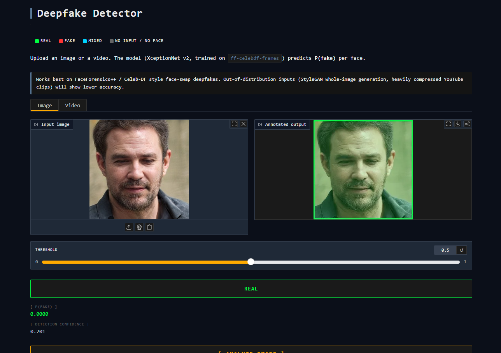
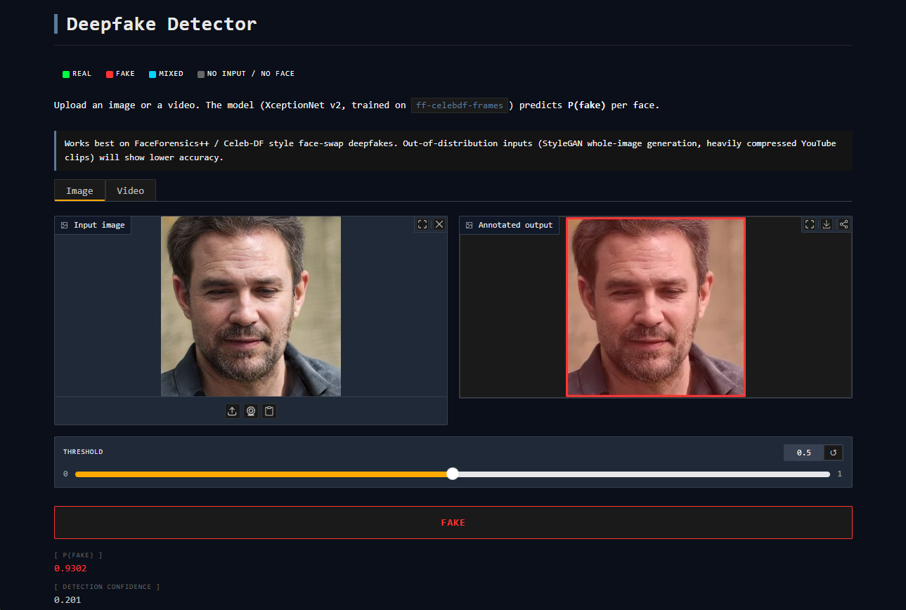
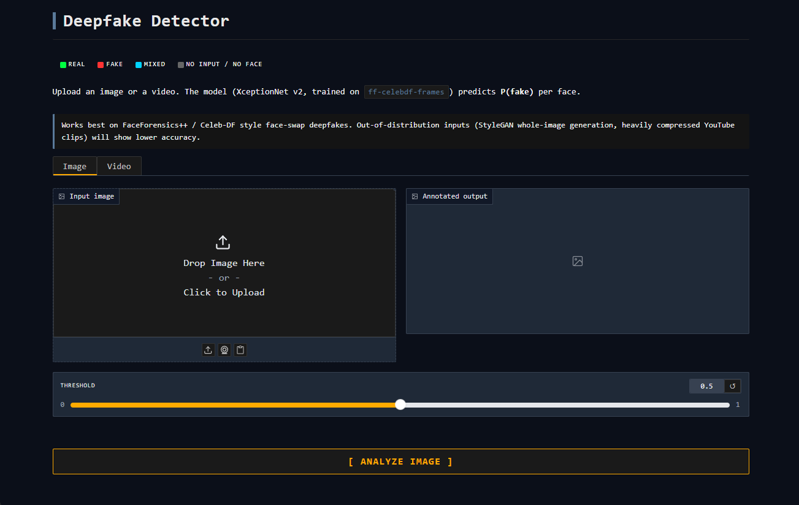
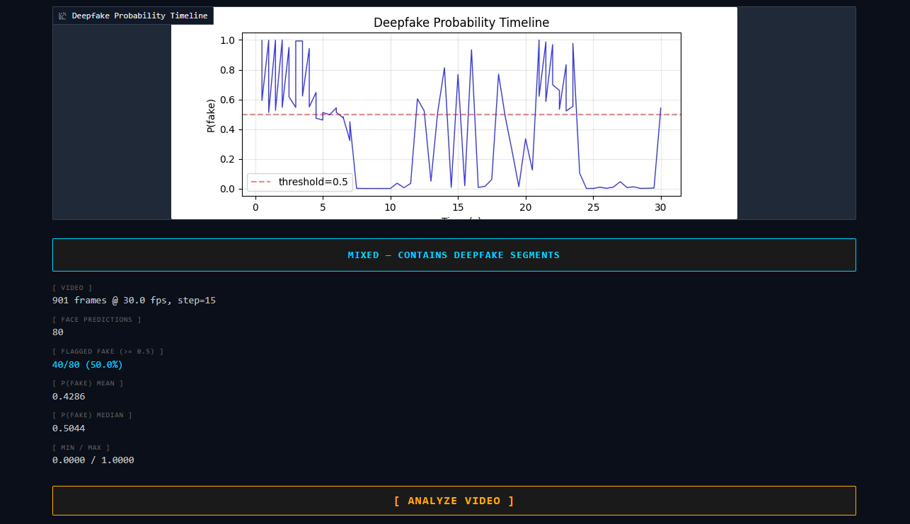

#  MALIN — Face Anti-Spoofing & Deepfake Detection

## Scope — two independent tracks

| Track | Input | Threat model | Deployment |
|-------|-------|--------------|------------|
| **1. Access Control Kiosk** | Live webcam (+ optional IR) | Physical spoof at the device: printed photos, screen replay, 3D masks | Real-time, kiosk terminal (GPU optional) |
| **2. Deepfake Detection (research)** | Pre-recorded images/videos (internet, uploads, forensic evidence) | Synthetic/manipulated face content in media | Offline / batch analysis, not for kiosks |

The two tracks share a repo because both are face-centric defenses, but their inputs, threats, and deployment contexts differ. Anti-spoofing + IR + blink secure the kiosk; the deepfake classifier studies media authentication.

## Features

**Access Control Kiosk (Track 1):**
- Face registration & recognition (InsightFace embeddings)
- Anti-spoofing (CDCN depth-map analysis)
- Passive liveness (EAR blink detection)
- IR camera material check (940nm) — instant screen/print rejection
- PyQt5 GUI demo with IR-mode toggle

**Deepfake Detection (Track 2):**
- XceptionNet binary (real vs fake) classifier on FaceForensics++ / Celeb-DF frames
- Benchmark with per-domain / per-source breakdown and ROC/histogram plots
- v1 → v2 → v3 → v3.4 iterative improvement (preprocessing fix → OOD expansion → maximum data)

## Architecture

### Track 1 — kiosk pipeline (real-time)

```
Webcam frame ─┐                ┌─ IR frame
              v                v
       Face detection     Material check (IR ≥ 940nm)
       (InsightFace)      ├─ too dark   → screen attack
              │           └─ too flat   → print attack
              v
        Blink liveness (EAR, dual signal with IR)
              │
              v
        Face embedding match (cosine vs registered users)
              │
              v
        AUTHORIZED  |  UNAUTHORIZED  |  DENIED
```

### Track 2 — media authentication (offline)

```
Image / video file ──> Face crop ──> XceptionNet (binary) ──> P(fake)
                                                          │
                                      Report per-frame / per-source metrics
```

## Demo

### Track 2 — Deepfake Detector (Gradio)

Terminal-themed web UI with Image / Video tabs, verdict badge (REAL / FAKE / MIXED), and `Deepfake Probability Timeline` plot for video.

Same StyleGAN-generated face — v2 misclassifies as REAL, v3 correctly detects FAKE:

| v2 (Before) | v3 (After) |
|:-----------:|:----------:|
|  |  |

<details>
<summary>More screenshots (UI, video analysis)</summary>

**Gradio UI**



**Video analysis — face-swap detection success.** MIXED verdict with per-frame P(fake) timeline.



</details>

### Track 1 — Access Control Kiosk (PyQt5)

Real-time webcam with face registration, CDCN anti-spoofing, blink-based liveness, and a runtime IR-mode toggle. _Screenshot pending — full demo captured after IR camera installation._

## Benchmark Results

### Anti-Spoofing (CDCN)

| Dataset | AUC | ACER |
|---------|-----|------|
| CelebA-Spoof (same-domain, 67K) | 0.9985 | 0.0272 |
| LCC-FASD (cross-dataset, 7.5K) | 0.8174 | 0.2463 |

### Model Comparison (LCC-FASD cross-dataset)

| Metric | Silent-FAS (historical) | CDCN |
|--------|-------------------------|------|
| AUC | 0.7757 | **0.8174** |
| ACER | 0.3070 | **0.2463** |

> Silent-FAS numbers predate the removal of its dependencies (commit `fefcd70`); kept for historical reference.

### Deepfake Detection — Track 2 (research)

Five training iterations from preprocessing-fix through OOD-expansion to maximum-data. This model is for **media authentication**, not for the kiosk pipeline.

| Version | Training data | Train Val | Test | Notes |
|---------|---------------|-----------|------|-------|
| **v1**  | ff-c23-frames (custom extraction) | 92.35% | 50.05% ACC, 0.6664 AUC (ff-celebdf) | Preprocessing mismatch — fake-biased |
| **v2**  | ff-celebdf-frames train CSV    | 95.50% | **95.63% ACC, 0.9929 AUC** (ff-celebdf) | Matched preprocessing, both domains in-domain |
| **v3**  | v2 data + StyleGAN3 + SDXL Diffusion + FFHQ real (~64k) | 97.16% | **97.60% ACC, 0.9972 AUC** (v3 test) | Adds whole-image GAN and diffusion categories |
| **v3.4** | v3 + WildDeepfake + ff_video_crops + SD1.5 + CelebA-HQ (~108k) | 97.43% | **97.70% ACC, 0.9967 AUC** | Maximum data — 13 sources, all categories 96%+ |

#### Per-split breakdown

| Split | v1 ACC | v1 AUC | v2 ACC | v2 AUC |
|-------|--------|--------|--------|--------|
| Overall                  | 0.5005 | 0.6664 | **0.9563** | **0.9929** |
| FF++                     | 0.4423 | 0.7085 | **0.9450** | **0.9809** |
| Celeb-DF                 | 0.5356 | 0.6014 | **0.9632** | **0.9957** |

#### Per-source accuracy — the fake-bias is gone in v2

| Source | v1 ACC | v2 ACC |
|--------|--------|--------|
| ffpp_fake  | 0.9461 | 0.9204 |
| celeb_fake | 0.9839 | 0.9869 |
| ffpp_real  | 0.3114 | **0.9513** |
| celeb_real | 0.1073 | **0.9406** |

> v1 reached 92.4% Val on FF++ c23 but collapsed to ~50% on `ff-celebdf-frames` because the face-crop pipeline differed. v2 retrains on `ff-celebdf-frames` directly so training and evaluation share one pipeline; real accuracy recovers from 11–31% to 94–95% and overall ACC jumps from 50% to 96%. This isolates **preprocessing alignment** as the dominant factor, separate from the harder cross-dataset problem. See [benchmark_eval.ipynb §4](notebooks/benchmark_eval.ipynb) for full analysis.

#### v3 expansion

v2's remaining blind spot: it only saw face-swap deepfakes. Whole-image GAN outputs (StyleGAN) and diffusion generations (SDXL) are out-of-distribution and get misclassified as real. v3 adds three new sources to address this:

- **StyleGAN3 — 10,000 generated faces** (FFHQ-pretrained, NVlabs NGC weights)
- **SDXL Diffusion — 10,000 prompt-varied faces** (text-to-image, local generation)
- **FFHQ — 10,000 real Flickr portraits** (balances the added fake samples)

Training is run with `val AUC` best-criterion, label smoothing 0.1, and early stopping.

**v3.4** (final) combines all available data (108k, 13 sources) with compression augmentation (JPEG/blur/downscale), RandomErasing, and [WildDeepfake](https://huggingface.co/datasets/xingjunm/WildDeepfake) internet video crops. Achieves 97.70% overall ACC — the highest across all versions — with all categories at 96%+. New sources include SD 1.5 diffusion (100%), CelebA-HQ real (99.9%), and InsightFace-cropped FF++ video frames (96%).

> **YouTube video limitation:** v3.4 achieves near-perfect accuracy on test images, but real-world YouTube videos remain challenging — h264 re-encoding destroys the subtle artifacts the model relies on. h264 pre-generation augmentation was also attempted (v3.5, 128k data) but single-frame h264 encoding does not replicate real video codec behavior (inter-frame prediction, motion compensation). The model is positioned as an **image-level media authenticator**. Temporal analysis (LSTM/Transformer over frame sequences) could address this by detecting inter-frame inconsistencies that survive compression — noted as a future research direction.

Per-category results (v2 → v3 → v3.4):

| Category | Source | v2 ACC | v3 ACC | v3.4 ACC |
|----------|--------|--------|--------|----------|
| Face-swap | ff-celebdf (FF++ + Celeb-DF) | 0.9563 | 0.9638 | **0.9609** |
| Whole-image GAN | StyleGAN3 holdout | 0.0594 | 0.9990 | **0.9951** |
| Diffusion (SDXL) | SDXL holdout | 0.0099 | 1.0000 | **1.0000** |
| Diffusion (SD 1.5) | SD 1.5 holdout | — | — | **1.0000** |
| Real (FFHQ) | FFHQ holdout | 0.8999 | 0.9960 | **0.9979** |
| Real (CelebA-HQ) | CelebA-HQ holdout | — | — | **0.9990** |
| WildDeepfake | Internet video crops | — | — | **0.9980** |
| FF++ video crops | InsightFace-cropped | — | — | **0.9607** |

## Project Structure

```
face-defense/
├── face_defense/
│   ├── data/                   # Dataset loaders
│   │   ├── celeba_spoof_dataset.py
│   │   └── ff_dataset.py       # FF++ binary real/fake
│   ├── models/
│   │   └── anti_spoof/
│   │       └── cdcn_model.py   # CDCN network
│   └── evaluation/             # Metrics, visualization
├── scripts/
│   ├── demo_gui.py             # PyQt5 access control demo
│   ├── demo_deepfake.py        # CLI deepfake detector (image/video)
│   ├── demo_deepfake_gui.py    # Gradio web UI deepfake detector
│   ├── demo_access.py          # OpenCV access control demo
│   ├── demo_webcam.py          # Webcam liveness demo
│   ├── train_cdcn.py           # CDCN training
│   ├── train_deepfake.py       # Deepfake training (CSV + augmentation)
│   ├── benchmark_cdcn.py       # CDCN benchmark
│   ├── benchmark_deepfake.py   # Deepfake benchmark (per-category)
│   ├── extract_video_frames.py # FF++ video → InsightFace crop
│   └── generate_stylegan_faces.py  # StyleGAN3 local generation
└── notebooks/                  # Benchmark evaluation
```

## Getting Started

### Prerequisites

- Python 3.10
- NVIDIA GPU with CUDA support (recommended)
- Conda (Miniconda or Anaconda)

### Installation

```bash
conda create -n face-defense python=3.10 -y
conda activate face-defense

pip install torch torchvision --index-url https://download.pytorch.org/whl/cu128
pip install insightface onnxruntime-gpu opencv-python mediapipe PyQt5 timm
pip install -e .
```

## Usage

### GUI Demo (Access Control)
```bash
python scripts/demo_gui.py --camera 0
```

The right panel includes an **IR MODE** toggle:
- With `--ir_camera`: starts **ON** (blink AND IR material must both pass)
- Without: starts **OFF** (blink-only fallback); toggling to ON shows an `IR MODE: NO CAMERA` warning state for demo purposes

### GUI Demo with IR Camera
```bash
python scripts/demo_gui.py --camera 0 --ir_camera 1
```

### OpenCV Demo
```bash
python scripts/demo_access.py --camera 0
```

### Webcam Liveness Demo
```bash
python scripts/demo_webcam.py --camera 0
```

### Training

```bash
# Anti-spoofing (CDCN)
python scripts/train_cdcn.py --data_root data/CelebA_Spoof --epochs 50

# Deepfake v1 — folder mode (FF++ c23 extracted frames)
python scripts/train_deepfake.py --data_root data/ff-c23-frames --model legacy_xception --epochs 30

# Deepfake v2 — CSV mode (ff-celebdf-frames, matched preprocessing)
python scripts/train_deepfake.py \
  --data_root data/ff-celebdf-frames \
  --train_csv data/ff-celebdf-frames/train_labels.csv \
  --val_csv data/ff-celebdf-frames/val_labels.csv \
  --model legacy_xception --epochs 30 --ckpt_suffix _v2
```

### Benchmark
```bash
# Anti-spoofing
python scripts/benchmark_cdcn.py

# Deepfake (FF++ + Celeb-DF test set) — add --plot_dir to save ROC/histograms
python scripts/benchmark_deepfake.py \
  --data_root data/ff-celebdf-frames \
  --csv data/ff-celebdf-frames/test_labels.csv \
  --checkpoint checkpoints/legacy_xception_v2_best.pth \
  --plot_dir plots --plot_tag _v2
```

See [benchmark results](notebooks/benchmark_eval.ipynb) for detailed evaluation.

## Kiosk Security Levels (Track 1)

| Level | Components | Detects | GPU |
|-------|-----------|---------|-----|
| Basic    | Blink liveness          | Photo, video replay        | No  |
| Standard | Blink + IR camera       | + Print, display attacks   | No  |
| Advanced | Blink + IR + CDCN       | + High-quality forgeries   | Yes |

> Deepfake detection (Track 2) is **not** part of the kiosk stack — the threat model (synthetic media) and deployment (offline analysis) do not match access-control terminals.

## Key Scripts

| Script | Description |
|--------|-------------|
| [demo_gui.py](scripts/demo_gui.py) | PyQt5 access control demo |
| [demo_deepfake.py](scripts/demo_deepfake.py) | CLI deepfake detector (image/video) |
| [demo_deepfake_gui.py](scripts/demo_deepfake_gui.py) | Gradio web UI deepfake detector |
| [train_cdcn.py](scripts/train_cdcn.py) | CDCN anti-spoofing training |
| [train_deepfake.py](scripts/train_deepfake.py) | Deepfake training (CSV + augmentation) |
| [benchmark_cdcn.py](scripts/benchmark_cdcn.py) | CDCN benchmark evaluation |
| [benchmark_deepfake.py](scripts/benchmark_deepfake.py) | Deepfake benchmark (per-category + compare) |
| [extract_video_frames.py](scripts/extract_video_frames.py) | FF++ video → InsightFace face crop |
| [generate_stylegan_faces.py](scripts/generate_stylegan_faces.py) | StyleGAN3 local face generation |

## References

### Papers
- [CDCN: Central Difference Convolutional Network](https://arxiv.org/abs/2003.04092) — Face anti-spoofing via depth map
- [FaceForensics++](https://arxiv.org/abs/1901.08971) — Deepfake detection benchmark (XceptionNet)
- [EfficientNet](https://arxiv.org/abs/1905.11946) — Efficient image classification

### Datasets
- [CelebA-Spoof](https://github.com/ZhangYuanhan-AI/CelebA-Spoof) — 561K anti-spoofing images
- [FaceForensics++](https://github.com/ondyari/FaceForensics) — Deepfake detection dataset
- [LCC-FASD](https://csit.am/2019/proceedings/PRIP/PRIP2.pdf) — Cross-dataset evaluation
- [NUAA](https://www.kaggle.com/datasets/olgabelitskaya/photo-paper-datasets) — Webcam anti-spoofing

### Libraries
- [InsightFace](https://github.com/deepinsight/insightface) — Face detection & recognition
- [MediaPipe](https://github.com/google/mediapipe) — Face mesh & landmark detection
- [timm](https://github.com/huggingface/pytorch-image-models) — PyTorch image models
