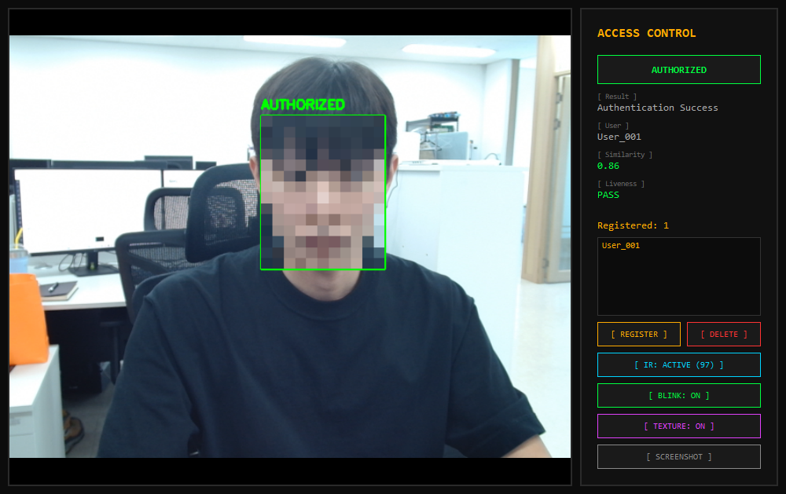
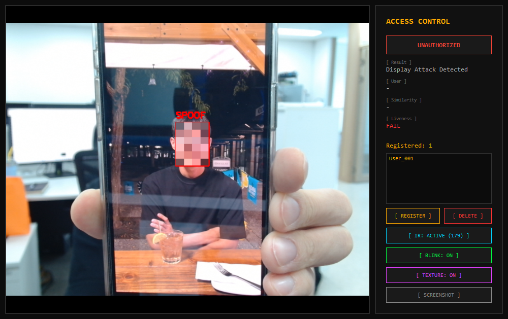
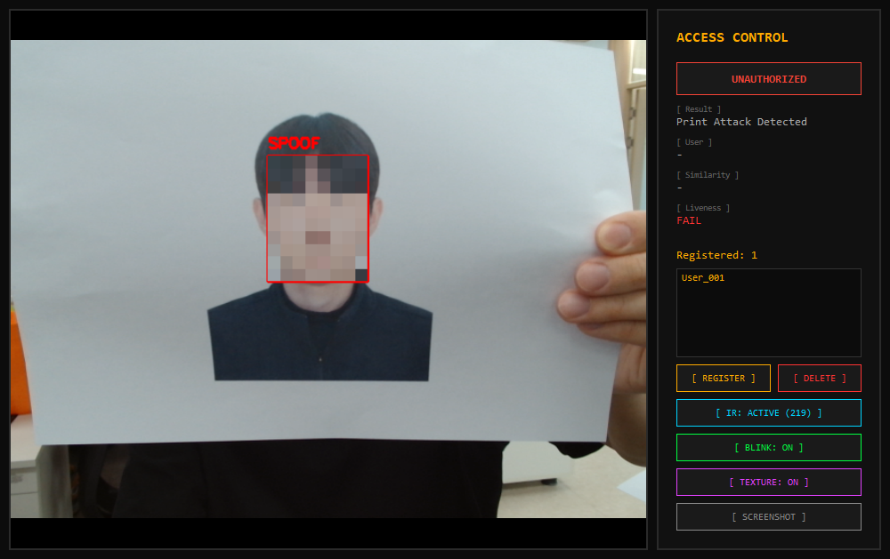

#  MALIN — Face Anti-Spoofing & Deepfake Detection

## Scope — three tracks

| Track | Input | Threat model | Deployment |
|-------|-------|--------------|------------|
| **[1. Access Control Kiosk](antispoof/)** | Live webcam + IR camera | Physical spoof: printed photos, screen replay, video replay | Real-time, kiosk terminal (GPU optional) |
| **[2. Deepfake Detection](deepfake/)** | Pre-recorded images/videos | Synthetic/manipulated face content in media | Offline / batch analysis |
| **[3. Emotion Recognition](emotion/)** | Live webcam | Facial expression classification | Real-time, CPU |

## Features

**Access Control Kiosk (Track 1):**
- Face registration & recognition (InsightFace embeddings)
- Multi-layer anti-spoofing: LBP texture, YCbCr skin color, IR ratio, blink detection
- PyQt5 GUI with IR / Blink / Texture toggle buttons

**Deepfake Detection (Track 2):**
- XceptionNet binary classifier — v3.4: **97.70% ACC, 0.9967 AUC** (108k, 13 sources)
- Gradio web UI with verdict badges and P(fake) timeline

**Emotion Recognition (Track 3):**
- Real-time 7-emotion classification (DeepFace + InsightFace)
- PyQt5 GUI with emotion bar chart and smoothing

## Demo

### Track 1 — Access Control Kiosk (PyQt5)

Real-time webcam with face registration, multi-layer anti-spoofing (LBP texture + skin color + IR ratio + blink), and runtime toggle buttons for each detection layer.

| Authorized | Display Attack | Print Attack |
|:----------:|:--------------:|:------------:|
|  |  |  |

### Track 2 — Deepfake Detector (Gradio)

Terminal-themed web UI with Image / Video tabs, verdict badge (REAL / FAKE / MIXED), and `Deepfake Probability Timeline` plot for video.

Same StyleGAN-generated face — v2 misclassifies as REAL, v3 correctly detects FAKE:

| v2 (Before) | v3 (After) |
|:-----------:|:----------:|
|  |  |

<details>
<summary>More screenshots (UI, video analysis)</summary>

**Gradio UI**


**Video analysis — face-swap detection success.** MIXED verdict with per-frame P(fake) timeline.


</details>

### Track 3 — Emotion Recognition (PyQt5)

Real-time 7-emotion classification (angry, disgust, fear, happy, sad, surprise, neutral) with InsightFace face detection and DeepFace emotion analysis. Background thread processing for smooth camera feed.

## Project Structure

```
face-defense/
├── shared/                     # Common utilities
│   ├── metrics.py              # AUC, EER, ACER metrics
│   ├── visualization.py        # ROC, score distribution plots
│   ├── constants.py            # ImageNet normalization
│   └── face_utils.py           # FaceDatabase, blink EAR, crop
├── antispoof/                  # Track 1 — Kiosk anti-spoofing
│   ├── models/cdcn_model.py    # CDCN network
│   ├── data/                   # CelebA-Spoof dataset
│   └── scripts/                # Demo, training, benchmark
├── deepfake/                   # Track 2 — Deepfake detection
│   ├── data/                   # FF++, FFT, video datasets
│   └── scripts/                # Demo, training, benchmark
├── emotion/                    # Track 3 — Emotion recognition
├── notebooks/                  # Benchmark evaluation
└── assets/                     # MALIN branding
```

## Getting Started

### Prerequisites

- Python 3.10
- NVIDIA GPU with CUDA support (recommended)
- Conda (Miniconda or Anaconda)

### Installation

```bash
conda create -n face-defense python=3.10 -y
conda activate face-defense

pip install torch torchvision --index-url https://download.pytorch.org/whl/cu128
pip install insightface onnxruntime-gpu opencv-python mediapipe PyQt5 timm
pip install -e .
```

### Quick Start

```bash
# Track 1 — Access Control Kiosk
python antispoof/scripts/demo_gui.py --camera 0 --ir_camera 1

# Track 2 — Deepfake Detector (Gradio)
python deepfake/scripts/demo_deepfake_gui.py
```

See each track's README for detailed usage, training, and benchmark instructions:
- [Anti-Spoofing (Track 1)](antispoof/README.md)
- [Deepfake Detection (Track 2)](deepfake/README.md)
- [Emotion Recognition (Track 3)](emotion/README.md)

## References

### Papers
- [CDCN: Central Difference Convolutional Network](https://arxiv.org/abs/2003.04092) — Face anti-spoofing via depth map
- [FaceForensics++](https://arxiv.org/abs/1901.08971) — Deepfake detection benchmark (XceptionNet)
- [EfficientNet](https://arxiv.org/abs/1905.11946) — Efficient image classification

### Datasets
- [CelebA-Spoof](https://github.com/ZhangYuanhan-AI/CelebA-Spoof) — 561K anti-spoofing images
- [FaceForensics++](https://github.com/ondyari/FaceForensics) — Deepfake detection dataset
- [LCC-FASD](https://csit.am/2019/proceedings/PRIP/PRIP2.pdf) — Cross-dataset evaluation
- [NUAA](https://www.kaggle.com/datasets/olgabelitskaya/photo-paper-datasets) — Webcam anti-spoofing

### Libraries
- [InsightFace](https://github.com/deepinsight/insightface) — Face detection & recognition
- [MediaPipe](https://github.com/google/mediapipe) — Face mesh & landmark detection
- [timm](https://github.com/huggingface/pytorch-image-models) — PyTorch image models
